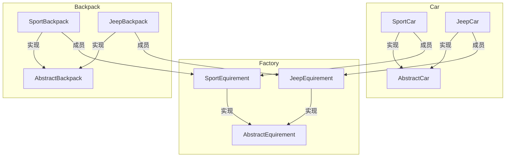

# 工厂模式

&nbsp;
## 简介

&emsp;&emsp;工厂模式（Factory Pattern）是 Java 中最常用的设计模式之一。这种类型的设计模式属于创建型模式，它提供了一种创建对象的最佳方式。在工厂模式中，我们在创建对象时不会对客户端暴露创建逻辑，并且是通过使用一个共同的接口来指向新创建的对象。

## 介绍
> <span style="color: rgb(216,181,118)"> 意图：</span>定义一个创建对象的接口，让其子类自己决定实例化哪一个工厂类，工厂模式使其创建过程延迟到子类进行。

> <span style="color: rgb(216,181,118)"> 主要解决：</span>主要解决接口选择的问题。

> <span style="color: rgb(216,181,118)"> 何时使用：</span> 我们明确地计划不同条件下创建不同实例时。

> <span style="color: rgb(216,181,118)"> 如何解决：</span> 让其子类实现工厂接口，返回的也是一个抽象的产品。

> <span style="color: rgb(216,181,118)"> 关键代码：</span> 创建过程在其子类执行。

> <span style="color: rgb(216,181,118)"> 应用实例：</span>   

```
    1、 您需要一辆汽车，可以直接从工厂里面提货，而不用去管这辆汽车是怎么做出来的，以及这个汽车里面的具体实现。  
    2、Hibernate 换数据库只需换方言和驱动就可以。 
```
&nbsp;
> <span style="color: rgb(216,181,118)"> 优点：  </span>  
```
    1、一个调用者想创建一个对象，只要知道其名称就可以了。  
    2、扩展性高，如果想增加一个产品，只要扩展一个工厂类就可以。  
    3、屏蔽产品的具体实现，调用者只关心产品的接口。 
```
&nbsp;
> <span style="color: rgb(216,181,118)"> 缺点：</span> 
```
    每次增加一个产品时，都需要增加一个具体类和对象实现工厂，使得系统中类的个数成倍增加，
    在一定程度上增加了系统的复杂度，同时也增加了系统具体类的依赖。这并不是什么好事。
```
&nbsp;
> <span style="color: rgb(216,181,118)"> 使用场景：  </span>  
```
    1、日志记录器：记录可能记录到本地硬盘、系统事件、远程服务器等，用户可以选择记录日志到什么地方。  
    2、数据库访问，当用户不知道最后系统采用哪一类数据库，以及数据库可能有变化时。  
    3、设计一个连接服务器的框架，需要三个协议，"POP3"、"IMAP"、"HTTP"，可以把这三个作为产品类，共同实现一个接口。 
```
&nbsp;
> <span style="color: rgb(216,181,118)">  注意事项：</span>
```
    作为一种创建类模式，在任何需要生成复杂对象的地方，都可以使用工厂方法模式。
    有一点需要注意的地方就是复杂对象适合使用工厂模式，而简单对象，特别是只需要通过 new 就可以完成创建的对象，
    无需使用工厂模式。如果使用工厂模式，就需要引入一个工厂类，会增加系统的复杂度。
```

&nbsp;

## 模式写法

&nbsp;
### 基本场景介绍
&emsp;&emsp;欧美主导的以赛车为主题的系列电影《速度与激情》系列相信大家都看过，里面的男主角(zhǔ jué，加个拼音，经常听到有人说什么主脚主脚的，虽然之前我也不确定是zhǔ jué还是主脚，但是我没念过主脚，我在不确定的情况下我都是念男一号)范·迪塞尔在每一集里面做不同的事情都是开不同的车子，相信大家都觉得很酷吧。人家酷也没办法，谁叫人家是大佬呢。这里我们试想一下，如果这是一套程序，我们该怎么设计？每次不同的画面或者剧情范·迪塞尔都需要按照导演的安排开不一样的车，去参加赛车需要开的是跑车，可能导演就会说下一场戏：范·迪塞尔下一场戏需要开跑车(参数)，要去参加五环首届跑车拉力赛，这时候场务(工厂类)接到导演的命令(跑车参数)后需要从车库开出一辆跑车(具体产品)交到范·迪塞尔手上让他去准备五环首届跑车拉力赛。这套程序的整个生命周期就算完成了。(什么？没完成？难不成你还真想来个五环首届跑车拉力赛了啊:)
<div align=center>


</div>

&emsp;&emsp;根据导演不同的指令，开的车是不一样的，但是车都是在车库中存在的。车都属于同一种抽象，车库里所有的车都有自己的特征，这些特征就是条件。导演发出指令的时候，只要告诉场务特征，场务就知道提什么车。

&nbsp;
### 简单工厂模式

<div align=center>
<span style="color: rgb(216,181,118)">简单工厂UML类图</span>


</div>

#### 代码演示

&nbsp;
> <span style="color: rgb(216,181,118)">抽象产品类代码： </span>

```C#
namespace CNBlogs.DesignPattern.Common
{
    /// <summary>
    /// 抽象产品类： 汽车
    /// </summary>
    public interface ICar
    {
        void GetCar();
    }
}
```

&nbsp;
> <span style="color: rgb(216,181,118)">具体产品类代码： </span>

```C#
namespace CNBlogs.DesignPattern.Common
{
    public enum CarType
    {
        SportCarType = 0,
        JeepCarType = 1,
        HatchbackCarType = 2
    }

    /// <summary>
    /// 具体产品类： 跑车
    /// </summary>
    public class SportCar : ICar
    {
        public void GetCar()
        {
            Console.WriteLine("场务把跑车交给范·迪塞尔");
        }
    }

    /// <summary>
    /// 具体产品类： 越野车
    /// </summary>
    public class JeepCar : ICar
    {
        public void GetCar()
        {
            Console.WriteLine("场务把越野车交给范·迪塞尔");
        }
    }

    /// <summary>
    /// 具体产品类： 两箱车
    /// </summary>
    public class HatchbackCar : ICar
    {
        public void GetCar()
        {
            Console.WriteLine("场务把两箱车交给范·迪塞尔");
        }
    }
}
```

&nbsp;
> <span style="color: rgb(216,181,118)">简单工厂核心代码：</span>

```C#
namespace CNBlogs.DesignPattern.Common
{
    public class Factory
    {
        public ICar GetCar(CarType carType)
        {
            switch (carType)
            {
                case CarType.SportCarType:
                    return new SportCar();
                case CarType.JeepCarType:
                    return new JeepCar();
                case CarType.HatchbackCarType:
                    return new HatchbackCar();
                default:
                    throw new Exception("爱上一匹野马,可我的家里没有草原. 你走吧！");
            }
        }
    }
}
```

&nbsp;
> <span style="color: rgb(216,181,118)">客户端调用代码： </span>

```C#
namespace CNBlogs.DesignPattern
{
    using System;
    using CNBlogs.DesignPattern.Common;

    class Program
    {
        static void Main(string[] args)
        {
            ICar car;
            try
            {
                Factory factory = new Factory();

                Console.WriteLine("范·迪塞尔下一场戏开跑车。");
                car = factory.GetCar(CarType.SportCarType);
                car.GetCar();
            }
            catch (Exception ex)
            {
                Console.WriteLine(ex.Message);
            }
        }
    }
}
```

&nbsp;
#### 优点/缺点

<pre>
    优点：
        简单工厂模式能够根据外界给定的信息，决定究竟应该创建哪个具体类的对象。
        明确区分了各自的职责和权力，有利于整个软件体系结构的优化。
    缺点：
        很明显工厂类集中了所有实例的创建逻辑，容易违反GRASPR的高内聚的责任分配原则
</pre>


&nbsp;
### 抽象工厂模式

&nbsp;
#### 概念

&emsp;&emsp;抽象工厂模式是所有形态的工厂模式中最为抽象和最具一般性的一种形态。抽象工厂模式是指当有多个抽象角色时，使用的一种工厂模式。抽象工厂模式可以向客户端提供一个接口，使客户端在不必指定产品的具体的情况下，创建多个产品族中的产品对象。根据里氏替换原则，任何接受父类型的地方，都应当能够接受子类型。因此，实际上系统所需要的，仅仅是类型与这些抽象产品角色相同的一些实例，而不是这些抽象产品的实例。换言之，也就是这些抽象产品的具体子类的实例。工厂类负责创建抽象产品的具体子类的实例。

&nbsp;
#### 扩展定义

&emsp;&emsp;为创建一组相关或相互依赖的对象提供一个接口，而且无需指定他们的具体类。

&nbsp;
#### 场景扩展

&emsp;&emsp;我们还是继续范·迪塞尔的例子，往往这些大牌生活中经常参加一些活动，或是商务活动或是公益活动。不管参加什么活动，加上老范(范·迪塞尔名字太长，以下文中简称老范)的知名度，他的车肯定不少，可能光跑车或者光越野车就有多辆。比如说有跑车(多辆，跑车系列的具体产品)、越野车(多辆，越野车系列的具体产品)、两箱车(多辆，两箱车系列的具体产品)。可能很多大牌明星都是如此的。假设老范家里，某一个车库(具体工厂)只存放某一系列的车(比如说跑车车库只存放跑车一系列具体的产品)，每次要某一辆跑车的时候肯定要从这个跑车车库里开出来。用了OO(Object Oriented,面向对象)的思想去理解，所有的车库(具体工厂)都是车库类(抽象工厂)的某一个，而每一辆车又包括具体的开车时候所背的包(某一具体产品。包是也是放在车库里的，不同的车搭配不同的包，我们把车和车对应的背包称作出去参加活动的装备)，这些具体的包其实也都是背包(抽象产品)，具体的车其实也都是车(另一个抽象产品)。

&nbsp;
#### 抽象化场景

> <span style="color: rgb(216,181,118)">下面让我们来捋一捋这个思路： </span>

<pre>
    <span style="color: rgb(216,181,118)">抽象工厂：</span>虚拟的车库，只是所有车库的一个概念。在程序中可能是一个借口或者抽象类，对其他车库的规范，开车和取包。
    
    <span style="color: rgb(216,181,118)">具体工厂：</span>具体存在的车库，用来存放车和车对应的背包。在程序中继承抽象工厂，实现抽象工厂中的方法，可以有具体的产品。
    
    <span style="color: rgb(216,181,118)">抽象产品：</span>虚拟的装备(车和对应的背包)，也只是所有装备的一个概念。在程序中可能是多个接口或者多个抽象类，对具体的装备起到规范。
    
    <span style="color: rgb(216,181,118)">具体产品：</span>活动参加的具体装备，它指的是组成装备的某一辆车或者背包。它继承自某一个抽象产品。
</pre>

&nbsp;
<div align=center>抽象工厂UML类图


</div>

#### 代码演示

&nbsp;
> <span style="color: rgb(216,181,118)">抽象工厂代码： </span>

```C#
namespace CNBlogs.DesignPattern.Common
{
    /// <summary>
    /// 抽象工厂类
    /// </summary>
    public abstract class AbstractEquipment
    {
        /// <summary>
        /// 抽象方法： 创建一辆车
        /// </summary>
        /// <returns></returns>
        public abstract AbstractCar CreateCar();

        /// <summary>
        /// 抽象方法： 创建背包
        /// </summary>
        /// <returns></returns>
        public abstract AbstractBackpack CreateBackpack();
    }
}
```

&nbsp;
> <span style="color: rgb(216,181,118)">抽象产品代码： </span>

```C#
namespace CNBlogs.DesignPattern.Common
{
    /// <summary>
    /// 抽象产品: 车抽象类
    /// </summary>
    public abstract class AbstractCar
    {
        /// <summary>
        /// 车的类型属性
        /// </summary>
        public abstract string Type
        {
            get;
        }

        /// <summary>
        /// 车的颜色属性
        /// </summary>
        public abstract string Color
        {
            get;
        }
    }

    /// <summary>
    /// 抽象产品: 背包抽象类
    /// </summary>
    public abstract class AbstractBackpack
    {
        /// <summary>
        /// 包的类型属性
        /// </summary>
        public abstract string Type
        {
            get;
        }

        /// <summary>
        /// 包的颜色属性
        /// </summary>
        public abstract string Color
        {
            get;
        }
    }
}
```

&nbsp;
> <span style="color: rgb(216,181,118)">具体工厂代码： </span>

```C#
namespace CNBlogs.DesignPattern.Common
{
    /// <summary>
    /// 运动装备
    /// </summary>
    public class SportEquipment : AbstractEquipment
    {
        public override AbstractCar CreateCar()
        {
            return new SportCar();
        }

        public override AbstractBackpack CreateBackpack()
        {
            return new SportBackpack();
        }
    }

    /// <summary>
    /// 越野装备  这里就不添加了，同运动装备一个原理，demo里只演示一个，实际项目中可以按需添加
    /// </summary>
    public class JeepEquipment : AbstractEquipment
    {
        public override AbstractCar CreateCar()
        {
            return new JeeptCar();
        }

        public override AbstractBackpack CreateBackpack()
        {
            return new JeepBackpack();
        }
    }
}
```

&nbsp;
> <span style="color: rgb(216,181,118)">具体产品代码：</span> 

```C#
namespace CNBlogs.DesignPattern.Common
{
    /// <summary>
    /// 跑车
    /// </summary>
    public class SportCar : AbstractCar
    {
        private string type = "Sport";
        private string color = "Red";

        /// <summary>
        /// 重写基类的Type属性
        /// </summary>
        public override string Type
        {
            get
            {
                return type;
            }
        }

        /// <summary>
        /// 重写基类的Color属性
        /// </summary>
        public override string Color
        {
            get
            {
                return color;
            }
        }
    }

    /// <summary>
    /// 运动背包
    /// </summary>
    public class SportBackpack : AbstractBackpack
    {
        private string type = "Sport";
        private string color = "Red";

        /// <summary>
        /// 重写基类的Type属性
        /// </summary>
        public override string Type
        {
            get
            {
                return type;
            }
        }

        /// <summary>
        /// 重写基类的Color属性
        /// </summary>
        public override string Color
        {
            get
            {
                return color;
            }
        }
    }
}
//具体产品可以有很多很多， 至于越野类的具体产品这里就不列出来了。
```

&nbsp;
> <span style="color: rgb(216,181,118)">创建装备代码：</span> 

```C#
namespace CNBlogs.DesignPattern.Common
{
    public class CreateEquipment
    {
        private AbstractCar fanCar;
        private AbstractBackpack fanBackpack;
        public CreateEquipment(AbstractEquipment equipment)
        {
            fanCar = equipment.CreateCar();
            fanBackpack = equipment.CreateBackpack();
        }

        public void ReadyEquipment()
        {
            Console.WriteLine(string.Format("老范背着{0}色{1}包开着{2}色{3}车。", 
                fanBackpack.Color, 
                fanBackpack.Type,
                fanCar.Color,
                fanCar.Type
                ));
        }
    }
}
```

&nbsp;
> <span style="color: rgb(216,181,118)">客户端代码：</span> 

```C#
namespace CNBlogs.DesignPattern
{
    using System;
    using System.Configuration;
    using System.Reflection;

    using CNBlogs.DesignPattern.Common;

    class Program
    {
        static void Main(string[] args)
        {
            // ***具体app.config配置如下*** //
            //<add key="assemblyName" value="CNBlogs.DesignPattern.Common"/>
            //<add key="nameSpaceName" value="CNBlogs.DesignPattern.Common"/>
            //<add key="typename" value="SportEquipment"/>
            // 创建一个工厂类的实例
            string assemblyName = ConfigurationManager.AppSettings["assemblyName"];
            string fullTypeName = string.Concat(ConfigurationManager.AppSettings["nameSpaceName"], ".",
                ConfigurationManager.AppSettings["typename"]);
            AbstractEquipment factory = (AbstractEquipment)Assembly.Load(assemblyName).CreateInstance(fullTypeName);
            CreateEquipment equipment = new CreateEquipment(factory);
            equipment.ReadyEquipment();
            Console.Read();
        }
    }
}
```

&nbsp;
> <span style="color: rgb(216,181,118)">结构图</span> 



#### 优点/缺点

<pre>
    优点：
        抽象工厂模式符合了六大原则中的开闭原则、里氏代换原则、依赖倒转原则等等。
        抽象工厂模式隔离了具体类的生产，使得客户并不需要知道什么被创建。
        当一个产品族中的多个对象被设计成一起工作时，它能保证客户端始终只使用同一个产品族中的对象。
        增加新的具体工厂和产品族很方便，无须修改已有系统，符合“开闭原则”。
    缺点：
        增加新的产品等级结构很复杂，需要修改抽象工厂和所有的具体工厂类，对“开闭原则”的支持呈现倾斜性。
        (不过说这个缺点好像有点吹毛求疵了)
</pre>

&nbsp;
<div align=right>

[实例样本](https://www.cnblogs.com/toutou/p/4899388.html)
</div>